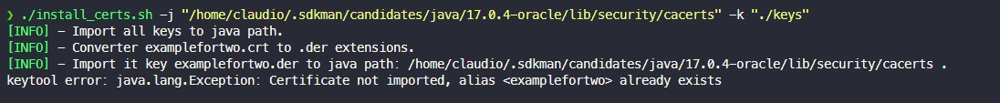

## About Project

- This script was made to facilitate the import of several keys for a version of java on your machine.



## How use

- In the folder of that project, run the command.

```bash
 ./install_certs.sh -k "./keysPath"
```

| Flag | flag meaning                                     |
| ---- | ------------------------------------------------ |
| -k   | folder where the keys to be imported are located |
